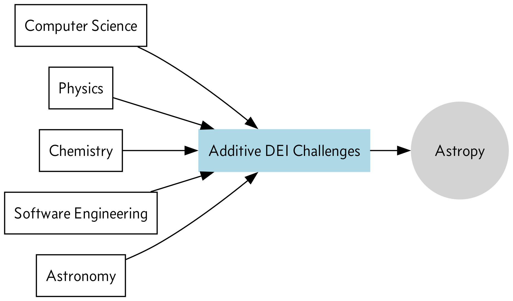

# Understanding and improving diversity, equity, and inclusion in the Astropy community
Open source software (OSS) projects tend to struggle with diversity, equity, and inclusion (DEI). It perhaps comes as no surprise: If we consider computer science and major scientific disciplines as reasonable proxies for people who might contribute to or use OSS tools, we can infer that OSS projects would struggle to engage and empower underrepresented communities. The percentage of computer science degree earners who come from underrepresented racial or ethnic groups, for example, has held steady at 20 to 25% for the last decade (see the [National Center for Education Statistics website](https://nces.ed.gov/ipeds/)). Pointed outreach to underrepresented groups may help, but the lack of diversity in training programs is a bottleneck and makes natural inflows of diverse talent difficult to attain for OSS projects.

DEI problems in open source, though, are not just about the demographic makeup of the community. Various studies have found that individuals from underrepresented backgrounds often feel unwelcome, experience stereotyping or threatening behavior, and perceive that they are excluded from certain communities, conversations, or events. [The 2021 Linux Foundation report](https://8112310.fs1.hubspotusercontent-na1.net/hubfs/8112310/LF%20Research/2021%20DEI%20Survey%20-%20Report.pdf) provides an overview of these issues and cites a host of survey data to illustrate the need for change. 

Astropy is aware of the need to improve the conditions that facilitate a diverse, empowered community and is developing a path forward for its own community. As part of this effort, we interviewed eight Astropy community members, with six of these interviews focused exclusively on perceptions of Astropy’s current state as well as what might be done to improve DEI outcomes. To contextualize the conversation and be precise about what drives these outcomes, we asked interviewees about their perception of the state of DEI at four levels: in astronomy, in computing, in open source software, and in the Astropy community. 

## Background

Astropy faces many challenges in its efforts to diversify its community and elevate the voices of underrepresented groups in community conversations and decisions. The fields of computer science, astronomy, physics, and open source software development have all performed poorly in attracting and retaining individuals who identify as members of underrepresented groups, in part because higher education operates as a bottleneck for the inflow of talented developers and users. 

Building on the earlier point about computer science education, we can look to astronomy education data to further explore the problem. The number of African Americans earning Ph.D.s in astronomy, for example, has fluctuated between zero and three individuals each year since 1999. In 2018, 805 Ph.D. earners identified as white and 76 identified as African American/Black, Hispanic, or American Indian/Alaska Native/Native Hawaiian. Raw numbers remain astonishingly low even among racial and ethnic groups whose numbers have increased in this period, such as Hispanic Americans (one earner in 1999 to 7 in 2019). The National Academies Astro2020 (p. 96) report put it succinctly: “Racial/ethnic diversity among astronomy faculty remains, in a word, abysmal.” The slightly promising trend in Hispanic American Ph.D. earners suggests that some improvements are being made, but other groups are not benefitting nearly as much. Further explanations and explorations of these data can be found in Chapter 3 of the [Astro2020 report](https://nap.nationalacademies.org/read/26141/chapter/1). 

Unsurprisingly, respondents in our interviews confirmed that they observed or experienced these disparities both within Astropy and in other communities they participated in. The reasons they provided often pointed to historical reasons (e.g., racism in science more broadly, longstanding inequalities in access to education and resources) as well as the overconcentration of practitioners in the U.S. and Europe (to the exclusion of other countries). 

Astropy’s situation is perhaps even more challenging because it sits at the intersection of a non-diverse scientific discipline and the open source software community, which similarly struggles with advancing DEI. A [survey led by GitHub in 2017](https://opensourcesurvey.org/2017/) queried 5,500 contributors to open projects. 95% of these surveyed contributors identified as men and 3% identified as women, while just 16% identified as ethnic or national minorities. Factors such as hostile interactions, dismissiveness, conflict, and unwelcoming language or content contributed to these outcomes.

Statistics and anecdotes about DEI in Astropy's core fields are daunting, and it would be easy for Astropy to take a passive approach. The community could, for example, trust that positive (albeit slow) trends will continue and wait for conditions to improve in the fields its community members come from. But rather than meet these realities with resignation, Astropy has continued to try to improve and diversify its community. The approach lends itself to the project becoming a mechanism of change for these other communities (e.g., astronomy and OSS) rather than a passive victim of shortcomings in overlapping fields. We designed and conducted our interviews with this in mind, asking Astropy community members how they felt about the current state of DEI and documenting their ideas about how to move forward. It is our hope that the findings can help Astropy become a catalyst for diversifying the fields it touches and promote equity, inclusion, and a welcoming environment within and outside of its community.

